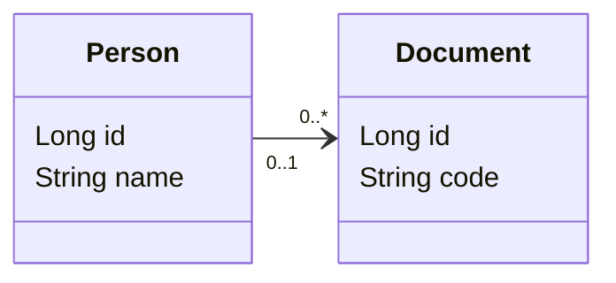
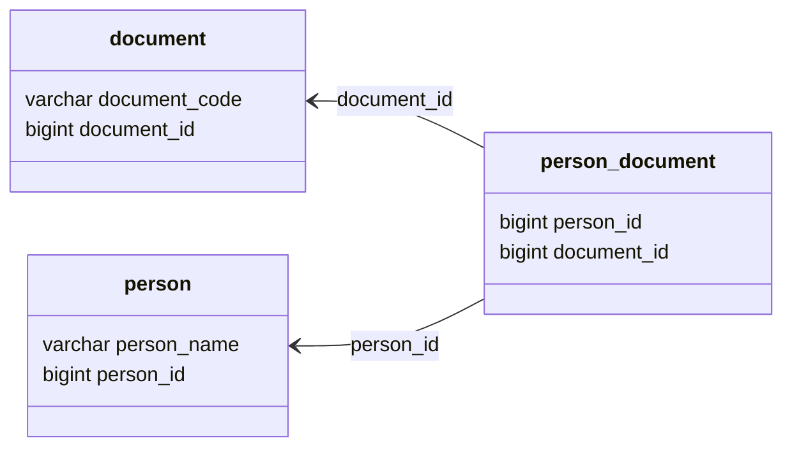

# POC: JPA One-to-Many Unidirectional

It demonstrates how to use JPA to implement one-to-many unidirectional relationship.

The goal is to be able to persist information about people, documents and links between them. Every person must have one
or none document registered, and we want to make the references consistent.

In this example we have the relationship implemented using a join table under the hood, unmapped in Java code.
The `Person` entity owns the relationship and contains the annotation `OneToMany` to define the relationship type
and `JoinTable` defining the two columns containing references to it and `Document` entity ID.

## How to run

| Description | Command          |
|:------------|:-----------------|
| Run tests   | `./gradlew test` |

## Preview

Entity Relationship Model:

Database schema:

